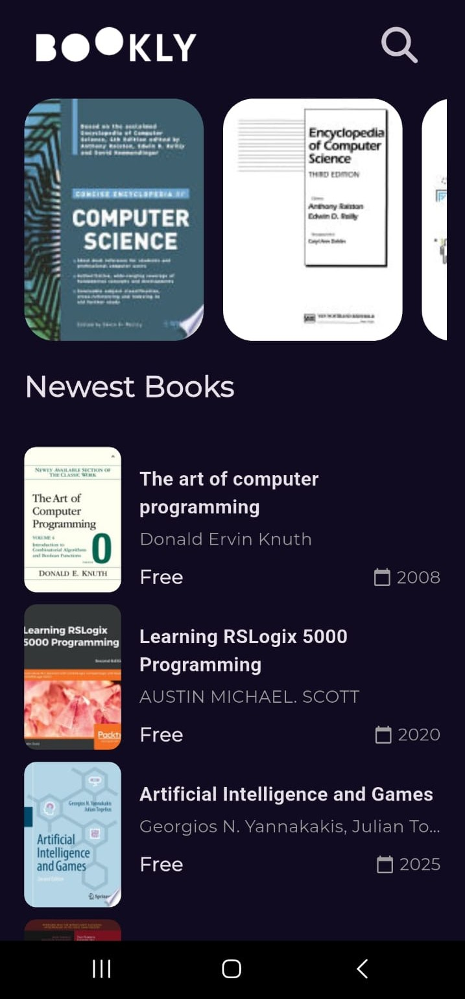
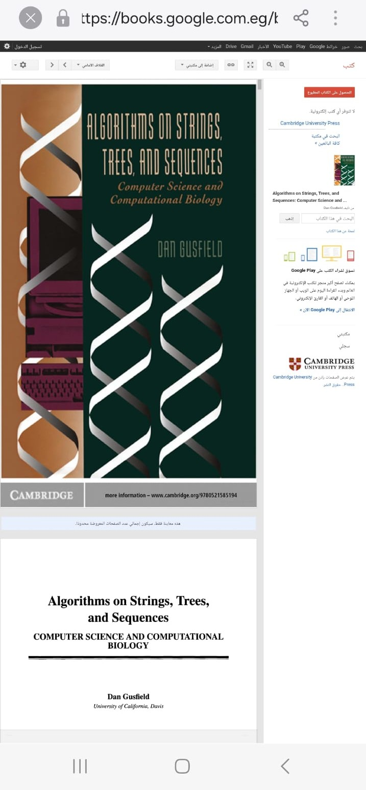
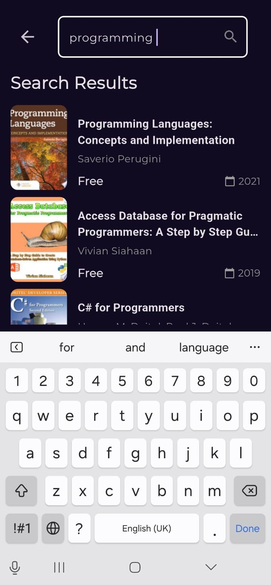

# 📚 BookVerse

A modern and elegant Flutter application for discovering and exploring books using the Google Books API. BookVerse provides a seamless reading experience with beautiful UI/UX design and smooth animations.

## 📸 Screenshots

<table>
  <tr>
    <td align="center"><b>Home Screen</b><br/>Browse featured and newest books</td>
    <td align="center"><b>Book Details</b><br/>View book information and similar books</td>
    <td align="center"><b>Book Preview</b><br/>Preview books via web link</td>
  </tr>
  <tr>
    <td></td>
    <td></td>
    <td></td>
  </tr>
  <tr>
    <td align="center"><b>Shimmer Loading</b><br/>Elegant loading effects</td>
    <td align="center"><b>Empty Search</b><br/>Search screen initial state</td>
    <td align="center"><b>Search Results</b><br/>Real-time book search</td>
  </tr>
  <tr>
    <td></td>
    <td></td>
    <td></td>
  </tr>
</table>

## ✨ Features

- 📖 Browse featured and newest books
- 🔍 Search for books by title, author, or keywords
- 📱 Responsive design for all screen sizes
- 🌐 Web support with CORS handling
- 🔄 Pull-to-refresh functionality
- 💫 Shimmer loading effects
- 📄 Detailed book information view
- 🔗 Preview books via web links
- 🎨 Clean and intuitive user interface
- ⚡ Fast and smooth performance

## 🛠️ Technologies & Packages

### Core Framework
- **Flutter** - UI framework for building natively compiled applications
- **Dart** - Programming language

### State Management
- **flutter_bloc (^9.1.1)** - Business Logic Component pattern for state management
- **bloc (^9.1.0)** - Core bloc library
- **equatable (^2.0.7)** - Simplify equality comparisons

### Architecture & Design Patterns
- **MVVM Architecture** - Model-View-ViewModel pattern for separation of concerns
- **Repository Pattern** - Abstract data sources
- **Cubit Pattern** - Simplified BLoC for state management
- **Dependency Injection** - Using GetIt for service locator

### Navigation
- **go_router (^16.3.0)** - Declarative routing package

### Networking
- **dio (^5.9.0)** - Powerful HTTP client for API calls
- **Google Books API** - Book data source

### Functional Programming
- **dartz (^0.10.1)** - Functional programming in Dart (Either, Option)

### Dependency Injection
- **get_it (^9.0.5)** - Service locator for dependency injection

### UI Components
- **shimmer (^3.0.0)** - Shimmer loading effect
- **cached_network_image (^3.4.1)** - Image caching and loading
- **font_awesome_flutter (^10.10.0)** - Icon library
- **google_fonts (^6.3.2)** - Custom fonts

### Utilities
- **url_launcher (^6.3.2)** - Launch URLs in external browser

## 📁 Project Structure

```
lib/
├── core/
│   ├── app_router.dart                 # App routing configuration
│   ├── constants/                      # App constants (colors, fonts, durations)
│   ├── errors/                         # Error handling (failures)
│   └── utils/                          # Utility classes (API service, service locator)
│       └── widgets/                    # Reusable widgets (shimmer effects, error widgets)
├── features/
│   ├── book_feature/
│   │   ├── data/
│   │   │   ├── models/                 # Data models
│   │   │   └── repositories/           # Repository implementations
│   │   └── presentation/
│   │       ├── manager/                # Cubits for state management
│   │       │   ├── featured_books_cubit/
│   │       │   ├── newest_books_cubit/
│   │       │   └── similar_books_cubit/
│   │       └── views/
│   │           └── widget/             # UI widgets
│   └── search/
│       ├── data/
│       │   └── repositories/           # Search repository
│       └── presentation/
│           ├── manager/
│           │   └── search_cubit/       # Search state management
│           └── views/
│               └── widgets/            # Search UI components
└── shared/
    └── splash/                         # Splash screen
```

## 🏗️ Architecture

The app follows **MVVM (Model-View-ViewModel)** architecture pattern with three main layers:

### 1. Model Layer (Data)
- **Models**: Data classes for API responses (BookModel, VolumeInfo, etc.)
- **Repositories**: Implementation of data sources (HomeRepoImpl, SearchRepoImpl)
- **API Service**: HTTP client wrapper for Google Books API

### 2. ViewModel Layer (Presentation Logic)
- **Cubits**: State management acting as ViewModels (FeaturedBooksCubit, SearchCubit)
- **States**: Representing UI states (Loading, Success, Failure)
- Business logic and data transformation

### 3. View Layer (UI)
- **Views**: UI screens (HomeView, SearchView, BookDetailsView)
- **Widgets**: Reusable UI components
- Observes ViewModel state changes via BlocBuilder

## 🎯 Key Features Implementation

### State Management with BLoC/Cubit
```dart
// Example: Featured Books Cubit
class FeaturedBooksCubit extends Cubit<FeaturedBooksState> {
  final HomeRepo homeRepo;
  
  Future<void> fetchFeaturedBooks() async {
    emit(FeaturedBooksLoading());
    var result = await homeRepo.fetchFeaturedBooks();
    result.fold(
      (failure) => emit(FeaturedBooksFailure(failure.errorMessage)),
      (books) => emit(FeaturedBooksSuccess(books)),
    );
  }
}
```

### Dependency Injection
```dart
void setupServiceLocator() {
  getIt.registerLazySingleton<ApiService>(() => ApiService(Dio()));
  getIt.registerLazySingleton<HomeRepoImpl>(() => HomeRepoImpl(getIt()));
  getIt.registerLazySingleton<SearchRepoImpl>(() => SearchRepoImpl(getIt()));
}
```

### Error Handling
- Custom failure classes for different error types
- Either type from dartz for functional error handling
- User-friendly error messages

### Shimmer Loading Effects
- Custom shimmer widgets for different content types
- Skeleton screens matching actual content layout
- Smooth loading experience

## 🚀 Getting Started

### Prerequisites
- Flutter SDK (>=3.9.2)
- Dart SDK
- Android Studio / VS Code
- An emulator or physical device

### Installation

1. Clone the repository
```bash
git clone https://github.com/YoussefShawky0/BookVerse.git
cd BookVerse
```

2. Install dependencies
```bash
flutter pub get
```

3. Run the app
```bash
flutter run
```

### Build for Production

#### Android
```bash
flutter build apk --release
```

#### iOS
```bash
flutter build ios --release
```

#### Web
```bash
flutter build web --release
```

## 🌐 API Integration

The app uses **Google Books API** to fetch book data:
- Base URL: `https://www.googleapis.com/books/v1/`
- Endpoints:
  - `/volumes?Filtering=free-ebooks&q=programming` - Featured books
  - `/volumes?Filtering=free-ebooks&Sorting=newest&q=programming` - Newest books
  - `/volumes?Filtering=free-ebooks&q={category}` - Similar books
  - `/volumes?Filtering=free-ebooks&q={query}` - Search results

## 🎨 Design Patterns Used

- **MVVM Pattern** - Model-View-ViewModel architecture
- **Repository Pattern** - Abstraction of data sources
- **BLoC/Cubit Pattern** - State management as ViewModel
- **Singleton Pattern** - Service locator (GetIt)
- **Factory Pattern** - Model creation from JSON
- **Observer Pattern** - State changes with BLoC

## 🔧 Configuration

### Fonts
- GT Sectra Fine (Book titles)
- Google Fonts (Various UI elements)

### Colors
- Custom color scheme defined in `app_colors.dart`
- Dark theme optimized

## 📱 Platform Support

- ✅ Android
- ✅ iOS
- ✅ Web
- ✅ Windows
- ✅ macOS
- ✅ Linux

## 🤝 Contributing

Contributions are welcome! Please feel free to submit a Pull Request.

1. Fork the project
2. Create your feature branch (`git checkout -b feature/AmazingFeature`)
3. Commit your changes (`git commit -m 'Add some AmazingFeature'`)
4. Push to the branch (`git push origin feature/AmazingFeature`)
5. Open a Pull Request

## 📝 License

This project is licensed under the MIT License - see the LICENSE file for details.

## 👨‍💻 Author

**Youssef Shawky**
- GitHub: [@YoussefShawky0](https://github.com/YoussefShawky0)

## 🙏 Acknowledgments

- Google Books API for providing book data
- Flutter team for the amazing framework
- All open-source package contributors

## 📧 Contact

For any inquiries or feedback, please reach out via GitHub issues.

---

Made with ❤️ using Flutter

